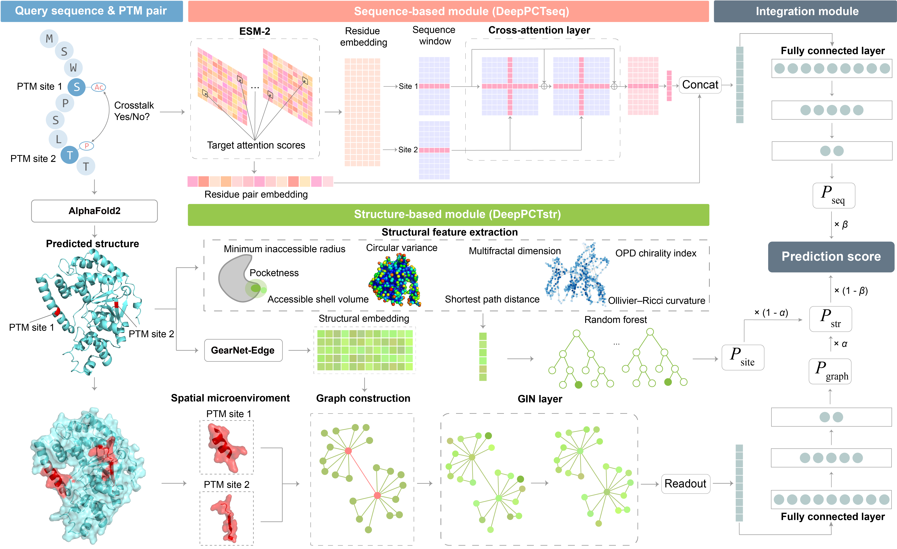

# DeepPCT

## Introduction

DeepPCT is a deep learning algorithm to identify PTM crosstalk within proteins using AlphaFold2-based structures. In this algorithm, one deep learning classifier was built for sequence-based prediction by combining the residue and residue pair embeddings with cross-attention techniques, while the other classifier was established for structure-based prediction by integrating the structural embedding and a graph neural network. Meanwhile, a machine learning classifier was established using a series of novel structural descriptors and a random forest model to complement the structural deep learning classifier. Finally, the three classifiers were merged to maximize their complementarity through a weighted combination strategy.


## Key Advantages
- **Improved Performance:** DeepPCT consistently outperforms SOTA methods across different evaluation scenarios.
- **Fast:** DeepPCT offers 60x faster inference speed than our previous model (PCTpred).
- **General**: Trained on AlphaFold2 predicted structures, DeepPCT can be applied to any protein when only its sequence is available.

## Usage

### Installation
1. Clone the repository to your local device.
    ```shell
    git clone https://github.com/hzau-liulab/DeepPCT
    cd DeepPCT
    ```
    Please note that this program is developed and tested on Linux CentOS 7. It is likely compatible with other Linux distributions. Windows is not supported due to a third-party package relies on the `fork` system call, unavailable on that OS. 


2. Install the necessary dependencies.  
    DeepPCT requires the following dependencies:
    * Software 
        ```text
        Python  3.9
        GHECOM  (Last modified: 2021/12/01)
        ```
    * Python packages
        ```text
        PyTorch                 1.13.0
        DGL                     1.1.0
        NumPy                   1.23.5
        SciPy                   1.10.1
        GraphRicciCurvature     0.5.3.1
        RDKit                   2022.9.3
        NetworkX                2.7.1
        scikit-learn            1.2.2
        torchdrug               0.2.0.post1
        Biopython               1.78
        fair-esm                2.0.0
        safetensors             0.3.1
        ```

    To avoid potential conflicts, we recommend creating a new conda environment for DeepPCT, and then install the required packages within this environment.
    ```shell
    conda create -n DeepPCT python=3.9.12
    conda activate DeepPCT
    ```

    For convenience, we provide an installation script to install these required Python packages.
    ```shell
    source installation_script.sh
    ```

    GHECOM requires users to provide their personal details for download. Please access [GHECOM website](https://pdbj.org/ghecom/) to download its source code. Follow the provided instructions to compile the code. Once compiled, transfer the GHECOM executable file (`ghecom`) to the `software/ghecom` directory, and then run the following command to set execution permissions:
    ```shell
    chmod +x software/ghecom/ghecom
    ```

3. Download the pre-trained model weights  
    Our pre-trained model weights are available at [Google Drive](https://drive.google.com/drive/folders/1aw25sR43EpZ8gmJhJY6l3StR3kcDUICV?usp=sharing).
    Three additional pre-trained models are required for this program:
    * `ESM-2`: [esm2_t33_650M_UR50D.pt](https://dl.fbaipublicfiles.com/fair-esm/models/esm2_t33_650M_UR50D.pt)
    * `ESM-2 regression`: [esm2_t33_650M_UR50D-contact-regression.pt](https://dl.fbaipublicfiles.com/fair-esm/models/esm2_t33_650M_UR50D-contact-regression.pt)
    * `GearNet-Edge`: [mc_gearnet_edge.pth](https://zenodo.org/records/7593637/files/mc_gearnet_edge.pth?download=1)

    Download and move these weights to the `model_weights` folder.

### Run prediction

1. Prepare input sequences  
    Each input sequence should be saved in a separate FASTA file named `seq_id.fasta`, where the prefix `seq_id` will be used as an identifier of the sequence. Please place all the input FASTA files in the `input/FASTA` directory.

2. Prepare AlphaFold2 predicted structures  
    For most of the existing proteins, you can directly download the predicted structures from [AlphaFold DB](https://alphafold.ebi.ac.uk/). 
    If the predicted structures are not available, you can use the following resources to predict the structures for your proteins sequence:
    * [ColabFold](https://colab.research.google.com/github/sokrypton/ColabFold/blob/main/AlphaFold2.ipynb) (recommended)
    * [AlphaFold2 on Colab (from DeepMind)](https://colab.research.google.com/github/deepmind/alphafold/blob/main/notebooks/AlphaFold.ipynb)

    Alternatively, you can install AlphaFold2 and run the prediction locally.
    The predicted structures should be saved in the PDB format. The filename should be `seq_id.pdb`, where the `seq_id` should match the identifier of the sequence. Please place all the predicted structures in the `input/PDB` directory.

3. Prepare input file  
    Format each line of the input file as following:
    ```text
    seq_id site1  site2
    ```
    where `seq_id` is the identifier of the sequence, and `site1` and `site2` are the positions of the two PTM sites. For instance:
    ```text
    P48431	S251	K245
    P48431	K245	S249
    P48431	Y277	S249
    P56693	T240	K55
    P56693	T244	K55
    ```

4. Run the prediction  
    With the input sequence, structure, and file ready, use the following command to run the prediction:
    ```shell
    python predict.py -i path/to/input/file -o path/to/output/directory
    ```
    
    By default, the output will be saved in TXT format. For easier parsing, you can use the `--jsonl` option to save the output in JSONL format.
    ```shell
    python predict.py -i path/to/input/file -o path/to/output/directory --jsonl
    ```

    Output example(TXT):
    ```text
    P48431	S251	K245	prediction_score	0.678	prediction_result	Positive
    P48431	K245	S249	prediction_score	0.065	prediction_result	Negative
    P48431	Y277	S249	prediction_score	0.038	prediction_result	Negative
    P56693	T240	K55	prediction_score	0.296	prediction_result	Positive
    P56693	T244	K55	prediction_score	0.224	prediction_result	Positive
    ```

    Output example(JSONL):
    ```jsonl
    {"seq_id": "P48431", "sites": [{"site": ["S251", "K245"], "prediction_score": 0.6783167167425156, "prediction_result": "Positive"}, {"site": ["K245", "S249"], "prediction_score": 0.06511083447009325, "prediction_result": "Negative"}, {"site": ["Y277", "S249"], "prediction_score": 0.03774637453317642, "prediction_result": "Negative"}]}
    {"seq_id": "P56693", "sites": [{"site": ["T240", "K55"], "prediction_score": 0.29571153268337247, "prediction_result": "Positive"}, {"site": ["T244", "K55"], "prediction_score": 0.22387358837008475, "prediction_result": "Positive"}]}
    ```


## Citation
Improved prediction of post-translational modification crosstalk within proteins using DeepPCT, *Submitted*, 2024.
